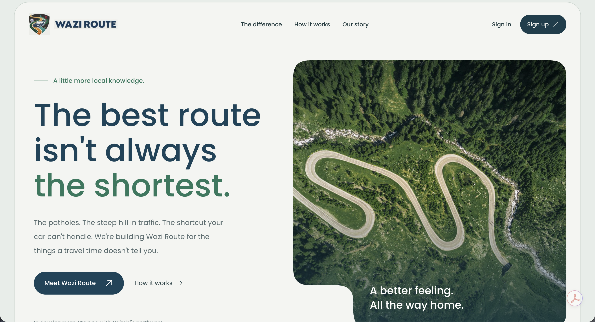

# Wazi Route

**The best route isn't always the shortest.**

Wazi Route is a mobile-friendly web application being built to help drivers choose routes based on their vehicle, driving preferences, and available road-condition information—not just distance or estimated travel time. It focuses on the things a travel time doesn't tell you, such as potholes, steep hills, and roads your car may struggle with.

Built with Elixir, Phoenix LiveView, and PostgreSQL.



## Run locally

### Prerequisites

- Elixir 1.17 or later with a compatible Erlang/OTP version.
- PostgreSQL installed and running locally.
- Git.

### Setup

1. Clone the repository:

   ```bash
   git clone https://github.com/petermirithu/Wazi-Route.git
   cd Wazi-Route
   ```

2. Check the database settings in [config/dev.exs](config/dev.exs). By default, the app connects to PostgreSQL on `localhost` using the username and password `postgres`, with database `wazi_route_dev`. Update these settings to match your local installation. The database user must be able to create databases.

3. Install dependencies, create and migrate the database, and build the assets:

   ```bash
   mix setup
   ```

4. Start the development server:

   ```bash
   mix phx.server
   ```

5. Open [localhost:4000](http://localhost:4000) in your browser.
